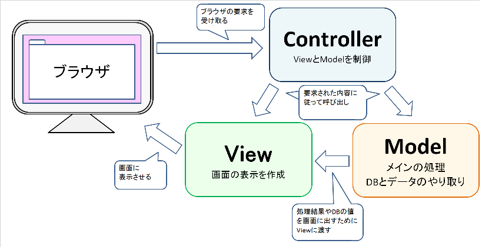
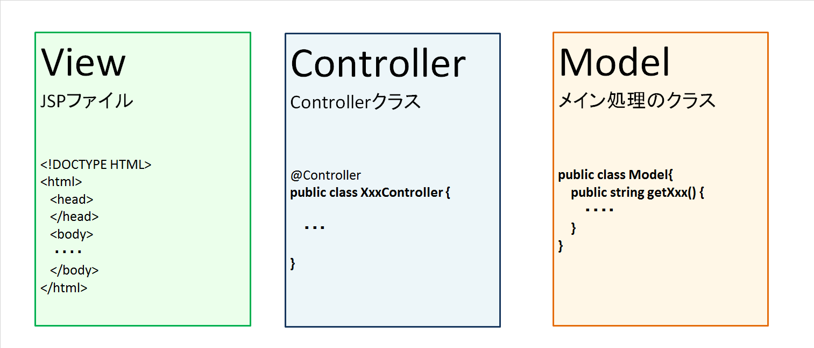

## MVCモデルとSpring

実際にチュートリアルを進める前に、MVCモデルの概要とSpringとの関連を  
解説します。  

内容
### MVCモデルとは

MVCモデルとは、システムの実装モデルのことで、「どうプログラムを作るか」の形式のようなものです。

MVCモデルでプログラムを作る際は、Model・View・Controllerの３つの役割に分けて実装します。
なぜわざわざ３つの役割に分けるのか。
それは、あらかじめ役割を決めて実装すると、開発者が扱いやすいプログラムになるからです。

例えば何のモデルもなくプログラムを実装しようとすると、
開発者はまっさらな状態からどんなクラスを作るかから考え始めなければいけません。
複数の人で実装する場合、人によって作り方が違うと、最終的に１つのシステムとしてまとめる際にそれぞれの違いを考慮しなければいけません。また、そのシステムを改修する場合、ソースのどこを修正すればいいのかを探すのが大変です。

しかしMVCモデルで作ると決まっていれば、
開発者はまっさらな状態から考えなくても、M・V・Cそれぞれの役割を持つクラスを作ればいいですし、
修正する人は修正したい役割のソースから修正個所を探せばいいわけです。

では、M・V・Cのそれぞれがどんな役割を持つのか、下図を見ながら説明していきます。

#### Model
Modelは、プログラムのメインを担う部分です。
DBからデータを取得し、プログラム内で加工し、Viewに渡して画面に出したり、画面で入力された値を受け取って加工してDBに保存したりするのがこの部分です。

#### View
Viewは、画面に表示する内容を作る部分です。
実際にブラウザに画面を表示するには、JSPやHTMLなどを使いますね。Modelで作成された値・内容がViewに渡され、ViewはそれをJSPに埋め込みます。それがブラウザに表示されます。

#### Controller
Controllerは、ViewとModelを制御します。制御という言葉だけでは実際何をするのかが分かりにくいですが、別の言葉で説明すると、画面⇔View・Model間の仲介、橋渡しといったイメージです。ブラウザで何かしらの入力があった後、まずControllerがその入力を受け取り、入力の内容を判断します。メインの処理が必要とされていればModelの該当する処理を呼び出し、画面出力が必要とされていればViewを呼び出します。また、Modelの処理結果をControllerが受け取り、Viewを呼び出すと同時に処理結果を渡して、Viewに画面表示させるなどします。

### SpringMVC と MVCモデル がどう対応するか

ここまで説明したMVCモデルをSpring Frameworkで使う時に使われるフレームワークが、SpringMVCです。
ではSpringMVCでプログラムを作るとどうなるかを下図を見ながら簡単に説明します。

#### View
SpringMVCにおいては、JSPファイルがViewに該当します。
**< form:○○ >** というSpringMVC用に用意されたカスタムタグや、**${ 変数名 }**という記述を使用することでController、Modelと値をやり取りすることができます。

#### Controller
SpringMVCではクラス宣言の前に**@Controller**というアノテーションを使用することで、そのクラスがControllerとして扱われます。

#### Model
メイン処理を担うModelは通常のクラスで作成します。  

***
※アノテーションとは  
アノテーションの説明
